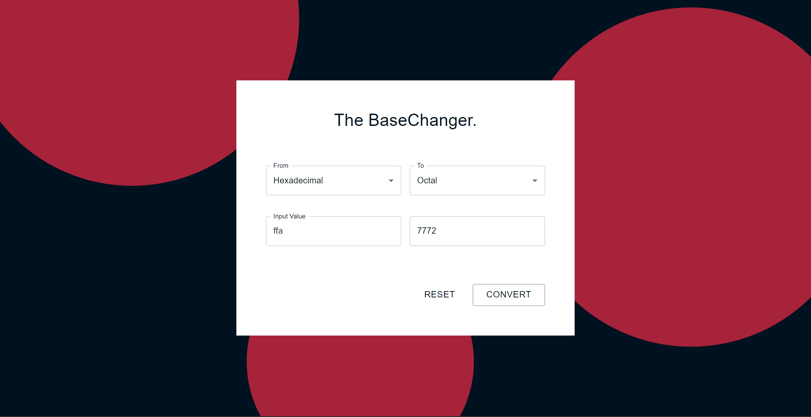
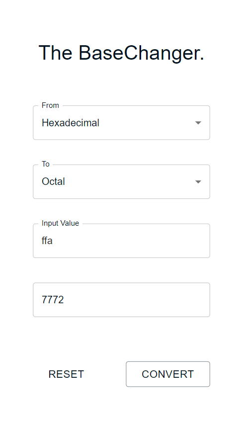

<html>
  

  <h1> THE BASECHANGER </h1>
  <h3>A modern tool that allows you to convert a numeric value from one base to another.</h3>
  

  

     
     
  

  

  <h3>Tap on this Link to check it out: https://eshantrivedi21.github.io/The-BaseChanger/</h3>
  

</html>
