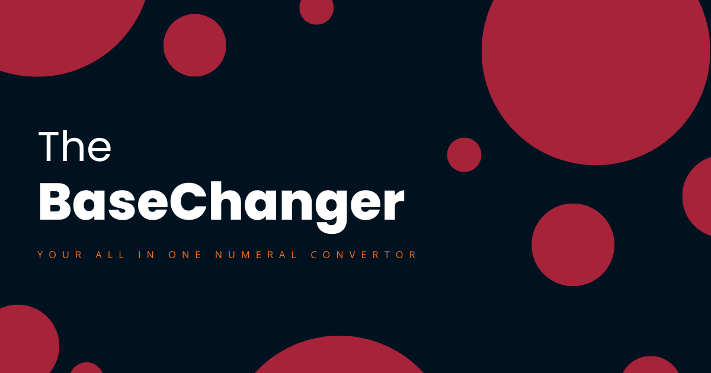

<html>
  

  <h1> THE BASECHANGER </h1>
  <h3>a contemporary tool for converting signed integers of any base to another shifted base.</h3>
  

  

    
  

  

  <h3>Check this website <a href="https://the-basechanger.netlify.app/">here</a></h3>
  

</html>
